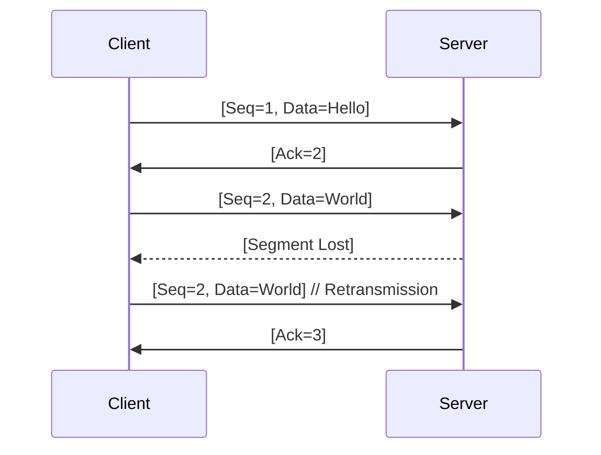

```mermaid
sequenceDiagram
  participant Client
  participant Server

  Client->>Server: [Seq=1, Data=Hello]
  Server->>Client: [Ack=2]
  Client->>Server: [Seq=2, Data=World]
  Server-->>Client: [Segment Lost]
  Client->>Server: [Seq=2, Data=World]  // Retransmission
  Server->>Client: [Ack=3]
```
