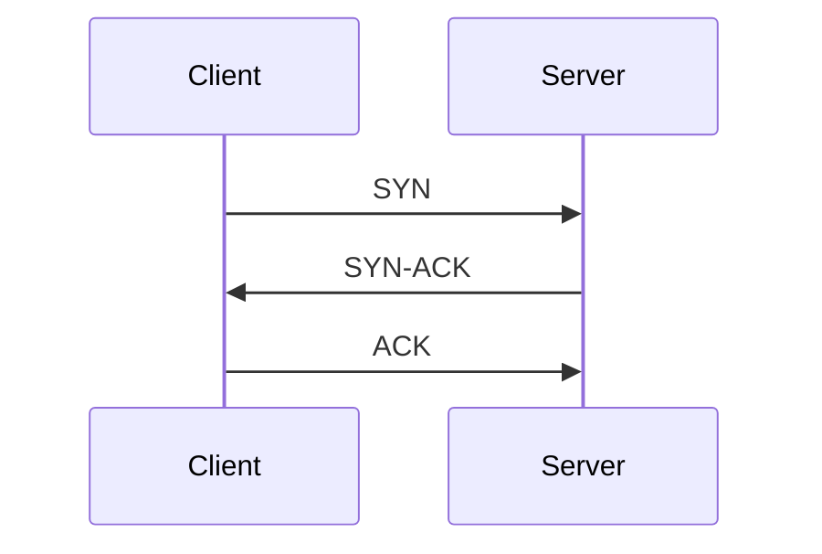
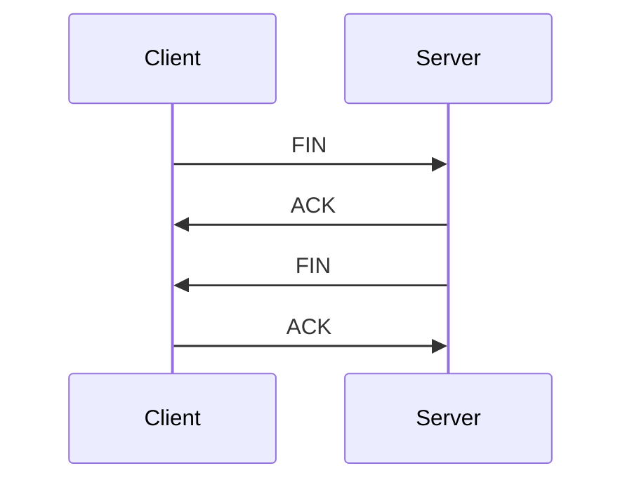
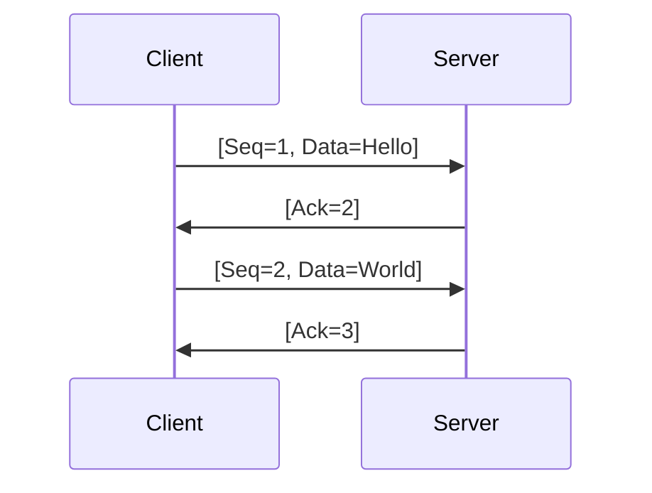

import BlockDiagram from "@/components/markdown/BlockDiagram";

# Transmission Control Protocol (TCP)

Understanding the Transmission Control Protocol (TCP) is essential for anyone involved in networking and cybersecurity. This document provides an overview of TCP, its function within network communications, and its importance in ensuring reliable data transmission.

## Introduction to TCP

The Transmission Control Protocol (TCP) is one of the core protocols of the Internet Protocol (IP) suite. It provides reliable, ordered, and error-checked delivery of data between applications running on hosts communicating via an IP network. TCP is a connection-oriented protocol, which means a connection is established and maintained until the exchange of messages between the communicating devices is complete.

## How TCP Works

TCP ensures reliable data transmission through a series of mechanisms, including error detection, retransmission of lost packets, and flow control. The process of establishing a TCP connection involves a three-step handshake, and the termination of the connection involves a four-step process.

### TCP Connection Establishment (Three-Way Handshake)

1. **SYN**: The client sends a TCP segment with the SYN (synchronize) flag set to the server, indicating it wants to establish a connection.
2. **SYN-ACK**: The server responds with a TCP segment with both SYN and ACK (acknowledgment) flags set, acknowledging the client's request and indicating readiness to establish the connection.
3. **ACK**: The client sends a TCP segment with the ACK flag set to the server, confirming the connection is established.

### TCP Connection Termination (Four-Way Teardown)

1. **FIN**: The client sends a TCP segment with the FIN (finish) flag set, indicating it wants to terminate the connection.
2. **ACK**: The server responds with a TCP segment with the ACK flag set, acknowledging the client's request.
3. **FIN**: The server sends a TCP segment with the FIN flag set, indicating it is ready to terminate the connection.
4. **ACK**: The client responds with a TCP segment with the ACK flag set, confirming the termination of the connection.

### Example of TCP Operation

1. **Client**: Sends a SYN segment to the server to initiate a connection.
2. **Server**: Responds with a SYN-ACK segment, acknowledging the connection request.
3. **Client**: Sends an ACK segment to establish the connection.
4. **Data Transfer**: The client and server exchange data segments.
5. **Client**: Sends a FIN segment to terminate the connection.
6. **Server**: Responds with an ACK segment, followed by a FIN segment to confirm termination.
7. **Client**: Sends a final ACK segment to complete the termination process.

## TCP Features

TCP includes several features to ensure reliable data transmission:

- **Sequencing**: TCP assigns a sequence number to each byte of data. The receiver uses these numbers to reassemble segments in the correct order and detect missing data.
- **Error Detection**: TCP includes a checksum field in each segment to detect errors in the transmitted data.
- **Retransmission**: If a segment is lost or corrupted, TCP retransmits it to ensure reliable delivery.
- **Flow Control**: TCP uses a flow control mechanism called sliding window to prevent overwhelming the receiver with too much data at once.
- **Congestion Control**: TCP employs congestion control algorithms to prevent network congestion and ensure fair usage of network resources.

### Flow Control with Sliding Window

## TCP Header Structure

<BlockDiagram
  colCount={32}
  rows={[
    [
      {
        label: "End of Previous Header",
        description: "IP header",
        length: 16,
        className: "dark:bg-gray-700 bg-gray-300",
      },
      {
        label: "Source Port",
        description: "8 bits",
        length: 8,
        className: "dark:bg-cyan-700 bg-cyan-300",
      },
      {
        label: "Destination Port",
        description: "8 bits",
        length: 8,
        className: "dark:bg-indigo-700 bg-indigo-300",
      },
    ],
    [
      {
        label: "Sequence Number",
        description: "32 bits",
        length: 32,
        className: "dark:bg-pink-700 bg-pink-300",
      },
    ],
    [
      {
        label: "Acknowledgment Number",
        description: "32 bits",
        length: 32,
        className: "dark:bg-purple-700 bg-purple-300",
      },
    ],
    [
      {
        label: "Flages",
        description: "16 bits",
        length: 16,
        className: "dark:bg-teal-700 bg-teal-300",
      },
      {
        label: "Window Size",
        description: "16 bits",
        length: 16,
        className: "dark:bg-orange-700 bg-orange-300",
      },
    ],
    [
      {
        label: "Checksum",
        description: "16 bits",
        length: 16,
        className: "dark:bg-lime-700 bg-lime-300",
      },
      {
        label: "Urgent Pointer",
        description: "16 bits",
        length: 16,
        className: "dark:bg-rose-700 bg-rose-300",
      },
    ],
    [
      {
        label: "Options",
        description: "Variable",
        length: 32,
        className: "dark:bg-yellow-700 bg-yellow-300",
      },
    ],
  ]}
/>

## Importance of TCP

TCP is crucial for ensuring reliable communication over IP networks. It is widely used for applications where data integrity and order are important, such as web browsing, email, file transfers, and remote access. Understanding TCP is essential for network professionals and cybersecurity experts to diagnose network issues, optimize performance, and secure network communications.

## Exercise
