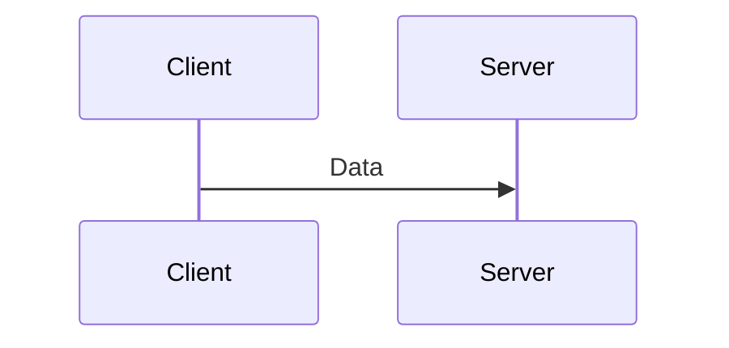

import BlockDiagram from "@/components/markdown/BlockDiagram";

# User Datagram Protocol (UDP)

Understanding the User Datagram Protocol (UDP) is essential for anyone involved in networking and cybersecurity. This document provides an overview of UDP, its function within network communications, and its importance in scenarios where speed and efficiency are prioritized over reliability.

## Introduction to UDP

The User Datagram Protocol (UDP) is one of the core protocols of the Internet Protocol (IP) suite. Unlike TCP, UDP is a connectionless protocol, which means it does not establish a connection before sending data. UDP is designed for applications that require fast, efficient transmission, where occasional loss of data is acceptable.

## How UDP Works

UDP provides a simple mechanism for transmitting datagrams (packets) between devices. Since it is connectionless, it does not perform handshakes, sequencing, or acknowledgment of received packets. This simplicity makes UDP fast but less reliable compared to TCP.

### UDP Transmission Process

1. **Data Preparation**: The application prepares the data to be sent and passes it to the UDP layer.
2. **Datagram Creation**: UDP encapsulates the data into a datagram, adding a header that includes source and destination ports, length, and checksum.
3. **Transmission**: The datagram is transmitted to the destination address specified in the header.
4. **Reception**: The destination device receives the datagram and passes it to the application based on the destination port number.

### Example of UDP Operation

1. **Client**: Sends a UDP datagram to the server with the data.
2. **Server**: Receives the datagram and processes the data.
3. **No Acknowledgment**: There is no acknowledgment or guarantee of delivery, so the client does not receive confirmation from the server.

## UDP Features

UDP includes several features that make it suitable for specific types of applications:

- **Connectionless**: UDP does not establish a connection before sending data, which reduces overhead and latency.
- **No Sequencing or Acknowledgment**: UDP does not sequence packets or acknowledge their receipt, making it faster but less reliable.
- **Checksum**: UDP includes a checksum to detect errors in the transmitted data. However, error detection and correction are not guaranteed.
- **Simple Header**: The UDP header is minimal, containing only essential information (source port, destination port, length, and checksum).

## UDP Header Structure

<BlockDiagram
  colCount={32}
  rows={[
    [
      {
        label: "Source Port",
        description: "16 bits",
        length: 16,
        className: "dark:bg-red-700 bg-red-300",
      },
      {
        label: "Destination Port",
        description: "16 bits",
        length: 16,
        className: "dark:bg-green-700 bg-green-300",
      },
      {
        label: "Length",
        description: "16 bits",
        length: 16,
        className: "dark:bg-blue-700 bg-blue-300",
      },
      {
        label: "Checksum",
        description: "16 bits",
        length: 16,
        className: "dark:bg-yellow-700 bg-yellow-300",
      },
    ],
  ]}
/>

## Importance of UDP

UDP is crucial for applications that require fast, efficient transmission with minimal overhead. It is widely used for real-time applications where speed is more critical than reliability, such as:

- **Streaming Media**: Audio and video streaming where some loss of data is tolerable to maintain playback quality.
- **Online Gaming**: Real-time multiplayer games where latency is crucial, and some data loss can be tolerated.
- **Voice over IP (VoIP)**: Voice communication over the internet, where timely delivery is more important than perfect reliability.
- **DNS Queries**: Domain Name System (DNS) queries use UDP for quick resolution of domain names to IP addresses.

## Exercise
